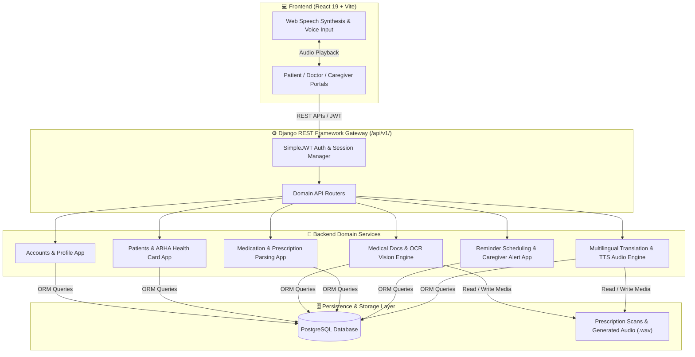

# 🏥 AI-Powered Healthcare Communication Assistant for Rural Communities

[](https://infyspringboard.onwingspan.com/)
[](https://www.python.org/)
[](https://www.djangoproject.com/)
[](https://www.django-rest-framework.org/)
[](https://react.dev/)
[](https://vitejs.dev/)
[](https://www.postgresql.org/)
[](LICENSE)

> **Infosys Springboard Virtual Internship Project Submission**  
> **Repository:** [Prince-git-hub-360/AI-Healthcare-Assistant-for-Rural-Communities](https://github.com/Prince-git-hub-360/AI-Healthcare-Assistant-for-Rural-Communities)  
> **Author:** Prince (`kumariafprince@gmail.com`)

---

## 📌 Executive Summary

The **AI-Powered Healthcare Communication Assistant for Rural Communities** is a production-grade, domain-driven digital healthcare platform specifically engineered to address language, literacy, and accessibility barriers in rural healthcare delivery across India.

By connecting **Rural Patients**, **Healthcare Workers (ASHA Workers & Doctors)**, and **Family Caregivers**, the system delivers:
- 🖼️ **OCR Prescription Scanning & Simplification**: Converts hand-written or printed doctor prescriptions into clear, structured medication regimens.
- 🗣️ **Multilingual Voice Guidance (Text-To-Speech)**: Provides audio-based dosage instructions in **12+ Indian regional languages** (Hindi, Bengali, Tamil, Telugu, Marathi, Kannada, Gujarati, Malayalam, Punjabi, etc.) for non-literate patients.
- 📅 **Interactive 5-Day Visual Pillbox & Reminders**: Tracks medication adherence with visual pill icons and automated timing alerts.
- 👨‍👩‍👧 **Caregiver Alerting & SOS Emergency Engine**: Sends immediate missed-dose alerts and SOS notifications to registered family caregivers.
- 🆔 **Digital Health Vault (ABHA Integration)**: Generates digital health card profiles with instant QR codes for rural consultations.
- 🔄 **Offline Synchronization & Backend Health Monitoring**: Guarantees reliable operation even under intermittent rural network connectivity.

---

## 🏛️ System Architecture



---

## 📁 Repository Directory Structure

```
AI-Healthcare-Assistant-for-Rural-Communities/
├── Backend/                            # Django 5.2 Enterprise REST Framework Backend
│   ├── apps/                           # Domain-Driven Modular Applications
│   │   ├── accounts/                   # JWT Auth, User Registration & Roles (Patient/Doctor/Caregiver)
│   │   ├── healthcare_workers/         # ASHA Worker & Doctor Directory & Patient Allocations
│   │   ├── medical/                    # Medical Uploads, OCR Prescription Parsing & Emergency Guidance
│   │   ├── medications/                # Prescription Records, Medication Parser & Drug Data
│   │   ├── patients/                   # Patient Demographics, Vault & ABHA Digital Health Card
│   │   ├── reminders/                  # Medication Scheduling, Visual Pillbox & Caregiver Alerts
│   │   └── translations/               # Multilingual Translation Engine & gTTS Voice Audio (.wav)
│   ├── common/                         # Shared System Enums (choices.py) & File Validators
│   ├── config/                         # Django Gateway (settings.py, urls.py, sync_views.py)
│   ├── media/                          # Uploaded Prescriptions & Generated Regional Audio Files
│   ├── scripts/                        # Automated Verification, Seeding & System Audit Scripts
│   │   ├── seed_lakshmi_demo.py        # Demo Rural Patient Data & Prescription Seeder
│   │   ├── test_all_features.py        # Full Platform Integration Suite
│   │   ├── verify_all_apis.py          # API Route Health Tester
│   │   ├── test_prescription_pipeline.py # OCR & Prescription Pipeline Test
│   │   └── test_voice_guidance_system.py # Multilingual Voice Audio Test
│   ├── manage.py                       # Django CLI Entry Point
│   ├── requirements.txt                # Python Dependencies
│   └── README.md                       # Enterprise Backend Specification
│
├── Frontend/                           # React 19 + Vite Single Page Application
│   ├── public/                         # Static Assets, Icons, and Audio Files
│   ├── src/                            # Modular Client Application Source
│   │   ├── api/                        # Centralized Axios Client & JWT Interceptors
│   │   ├── app/                        # App Entry Setup & Context Provider Wrappers
│   │   ├── assets/                     # UI Image Assets & Logos
│   │   ├── components/                 # Reusable Interface Components
│   │   │   ├── application/            # Functional Workflows & Search Components
│   │   │   ├── auth/                   # Login & Multi-step Registration Forms
│   │   │   ├── layout/                 # Navbar, Sidebar, Footer & Top Navigation
│   │   │   ├── marketing/              # Landing Banners & Hero Sections
│   │   │   ├── medical/                # Prescription Upload & OCR Display Views
│   │   │   ├── profile/                # Profile Dashboard & ABHA Health Card Display
│   │   │   └── ui/                     # Badges, Buttons, Modals & Toast Alerts
│   │   ├── context/                    # AuthContext & Language Switcher State
│   │   ├── features/                   # Role-Based Feature Modules
│   │   │   ├── auth/                   # Authentication Workflows
│   │   │   ├── caregiver/              # Caregiver Dashboard & Patient Monitoring
│   │   │   ├── healthcare-worker/      # Doctor & ASHA Worker Workflows
│   │   │   ├── patient/                # Patient Vault, Voice Assistant & Treatment Planner
│   │   │   └── public/                 # Public Landing Pages, About & Guidance
│   │   ├── hooks/                      # Custom React Hooks (Speech, Auth, Reminders)
│   │   ├── pages/                      # Top-Level Page Views & Auth Routes
│   │   ├── services/                   # Service Layer for Backend Endpoints
│   │   ├── shared/                     # Shared Types, Enums & Icons
│   │   ├── styles/                     # CSS Modular Styling
│   │   ├── utils/                      # Route Constants, Speech Synthesis & Formatters
│   │   ├── App.jsx                     # Root React Component
│   │   ├── main.jsx                    # Vite DOM Mount Entrypoint
│   │   └── index.css                   # Global Modern UI Styles
│   ├── index.html                      # HTML Blueprint
│   ├── package.json                    # Node Dependencies & Build Scripts
│   ├── tailwind.config.js              # Tailwind CSS Configuration
│   ├── vite.config.js                  # Vite Dev Server & Proxy Settings
│   └── README.md                       # Frontend Specification
│
├── .gitignore                          # Configured for Node, Python venv, env & media files
├── LICENSE                             # MIT License
├── pyrightconfig.json                  # Python Type Checking Config
└── README.md                           # Master Project Overview (This File)
```

---

## 🛠️ Technology Stack

| Component | Tech / Tool | Description / Version |
| :--- | :--- | :--- |
| **Backend Framework** | Django 5.2 | High-level Python web framework |
| **API Framework** | Django REST Framework (DRF) | RESTful API architecture with interactive browsable API |
| **Authentication** | SimpleJWT | JSON Web Token authentication with auto-refresh mechanism |
| **Database** | PostgreSQL | Relational database (`healthcare_assistant_db`) |
| **OCR Vision Engine** | PyTesseract & Pillow | Text token extraction from medical prescriptions |
| **Voice Synthesis** | gTTS (Google TTS) / Web Speech API | Multilingual audio generation (.wav) in 12+ regional languages |
| **Frontend Framework** | React 19.2 | Component-driven Single Page Application (SPA) |
| **Build Tool & Bundler** | Vite 8.2 | Lightning-fast HMR dev server and bundler |
| **Styling & Design** | Tailwind CSS + Modern Custom CSS | Clean, accessible, responsive design tailored for rural users |
| **HTTP Client** | Axios | Configured with automatic JWT token attachment and interceptors |
| **API Documentation** | drf-spectacular | OpenAPI 3.0 specification generator & Swagger UI |

---

## ⚡ Key Platform Capabilities

1. **Smart Role-Based Portals**: Differentiated views for **Patients**, **Doctors / ASHA Workers**, and **Caregivers**.
2. **Differentiated Auth Responses**: Distinguishes between non-existent accounts (`USER_NOT_FOUND`) and incorrect credentials (`INVALID_PASSWORD`), seamlessly guiding new users to registration.
3. **OCR Automated Prescription Processing**:
   - Scans doctor prescriptions.
   - Automatically parses drug names, dosages, frequencies, and duration.
   - Instantly schedules corresponding visual pillbox reminders.
4. **12+ Indian Regional Languages**: Voice guidance available in **Hindi, Bengali, Tamil, Telugu, Marathi, Kannada, Gujarati, Malayalam, Punjabi, English**, and more.
5. **Interactive 5-Day Visual Pillbox Calendar**: Easily recognizable pill symbols and color-coded morning/afternoon/evening schedules designed for low-literacy users.
6. **Caregiver Alert System**: Escalates unacknowledged reminders to family members via real-time alerts.
7. **ABHA Digital Health Card & Emergency SOS**: Instant digital ID card generation with downloadable/scannable QR codes and emergency contact notification.

---

## 🚀 Local Installation & Setup Guide

### 📋 Prerequisites
- **Python 3.10+** installed
- **Node.js 18+** & `npm` installed
- **PostgreSQL** (or fallback SQLite for quick evaluation)
- **Git** installed

---

### 1️⃣ Backend Setup (Django)

```powershell
# Navigate to Backend directory
cd Backend

# Create and activate virtual environment
python -m venv venv

# Windows PowerShell:
.\venv\Scripts\activate
# Linux/macOS:
# source venv/bin/activate

# Install required Python packages
pip install -r requirements.txt

# Apply database migrations
python manage.py makemigrations
python manage.py migrate

# Seed demonstration data (Lakshmi Demo Patient & Sample Prescriptions)
python scripts/seed_lakshmi_demo.py

# Start Django development server
python manage.py runserver
```

> 🌐 **Backend API:** `http://127.0.0.1:8000/`  
> 📑 **Master API Landing:** `http://127.0.0.1:8000/api/`  
> 📖 **OpenAPI / Swagger Docs:** `http://127.0.0.1:8000/api/schema/swagger-ui/`

---

### 2️⃣ Frontend Setup (React + Vite)

Open a **new terminal tab**:

```powershell
# Navigate to Frontend directory
cd Frontend

# Install node dependencies
npm install

# Launch Vite development server
npm run dev
```

> 🌐 **Frontend Application:** `http://localhost:5173/`

---

## 🧪 Verification & Testing Scripts

Run the built-in automated backend verification tools to validate all domain apps:

```powershell
cd Backend

# Run complete platform feature integration test
python scripts/test_all_features.py

# Verify API endpoints and route availability
python scripts/verify_all_apis.py

# Test OCR prescription extraction pipeline
python scripts/test_prescription_pipeline.py

# Test multilingual voice audio generation
python scripts/test_voice_guidance_system.py
```

---

## 📡 Primary API Endpoints Matrix

All endpoints are versioned under `/api/v1/` (or accessible via DRF master routes under `/api/`):

| Domain | Method | Endpoint Path | Description |
| :--- | :---: | :--- | :--- |
| **Authentication** | `POST` | `/api/v1/auth/register/` | Register new user & profile (Patient/Doctor/Caregiver) |
| **Authentication** | `POST` | `/api/v1/auth/login/` | Authenticate user & receive JWT access + refresh tokens |
| **Authentication** | `GET / PUT`| `/api/v1/auth/profile/` | Fetch or update user profile |
| **Patients** | `GET / POST`| `/api/v1/patients/` | List and create patient master records |
| **Patients** | `GET / PUT`| `/api/v1/patients/profile/` | Access ABHA card details and profile data |
| **Medical** | `GET / POST`| `/api/v1/medical-documents/` | Upload & list prescription images or medical documents |
| **Medications** | `GET / POST`| `/api/v1/medications/` | List or create structured medication records |
| **Medications** | `POST` | `/api/v1/medications/parse-prescription/` | OCR text extraction & raw prescription parsing |
| **Reminders** | `GET / POST`| `/api/v1/reminders/` | List active medication reminders and visual schedules |
| **Reminders** | `POST` | `/api/v1/reminders/trigger-due-reminders/` | Process due alarms & trigger caregiver SMS/alerts |
| **Translations** | `GET / POST`| `/api/v1/translations/` | Retrieve and request translation records |
| **Translations** | `POST` | `/api/v1/translations/generate-voice-guidance/` | Generate regional translation and `.wav` voice audio |
| **System Sync** | `POST` | `/api/v1/sync/offline-batch/` | Sync offline batch records from mobile client |
| **System Health** | `GET` | `/api/v1/sync/health-check/` | System status & database connectivity diagnostic |

---

## 📤 Infosys Springboard GitHub Push Instructions

Follow these exact steps to push this project to the repository assigned by Infosys Springboard:

### 1. Verify Git Remote Configuration
```powershell
git remote -v
```
If the origin remote is set to your Infosys Springboard repo link (`https://github.com/Prince-git-hub-360/AI-Healthcare-Assistant-for-Rural-Communities.git`), proceed. If not, add/update it:
```powershell
git remote set-url origin https://github.com/Prince-git-hub-360/AI-Healthcare-Assistant-for-Rural-Communities.git
```

### 2. Stage and Commit All Project Files
```powershell
git add .
git commit -m "docs: complete enterprise README specification and Infosys Springboard submission updates"
```

### 3. Push to GitHub Repository
```powershell
git push -u origin main
```
*(If your default branch is `master`, use `git push -u origin master`)*

---

## 📜 License & Acknowledgments

- **License**: Distributed under the [MIT License](LICENSE).
- **Project Submission**: Submitted for **Infosys Springboard Virtual Internship**.
- **Special Thanks**: Infosys Springboard mentors and instructors for guidance on domain-driven software architecture for social impact.
