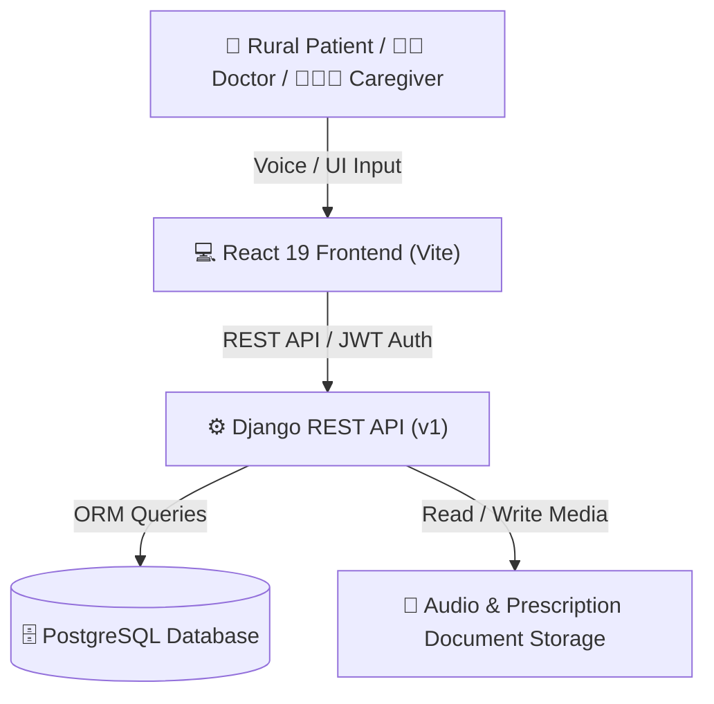

# AI-Powered Healthcare Communication Assistant for Rural Communities

A production-grade, domain-driven healthcare communication platform designed for rural patients, healthcare workers (ASHA workers & Doctors), and family caregivers. It bridges language, literacy, and accessibility barriers using AI-powered voice guidance, OCR prescription parsing, multilingual translation, ABHA digital health cards, and automated medication reminders.

---

## 🌟 Architecture & System Overview



---

## 📁 Repository Structure

```
AI-Healthcare-Assistant-for-Rural-Communities/
├── Backend/                            # Django REST Framework Backend
│   ├── apps/                           # Domain-Driven Django Modules
│   │   ├── accounts/                   # User Auth, Profiles & Role Management (Patient/Doctor/Caregiver)
│   │   ├── healthcare_workers/         # ASHA Worker & Doctor Management, Follow-ups
│   │   ├── medical/                    # Medical Records, Consultations & Emergency Alerts
│   │   ├── medications/                # Prescriptions, OCR Parsing & Drug Directories
│   │   ├── patients/                   # Patient Master Data & ABHA Health Card Integration
│   │   ├── reminders/                  # Medication Scheduling, Adherence & Alarm Logs
│   │   └── translations/               # Multilingual Voice Guidance & Translation Engine
│   ├── common/                         # Shared Helpers, Exception Handlers & Utilities
│   ├── config/                         # Django Settings, URL Router & OpenAPI Docs Config
│   ├── media/                          # Uploaded Prescriptions & Generated Voice Audio Files
│   ├── scripts/                        # Database Seeding, Test Verification & Maintenance Scripts
│   ├── manage.py                       # Django CLI Entry Point
│   ├── requirements.txt                # Backend Python Dependencies
│   └── README.md                       # Backend Architecture Specification
│
├── Frontend/                           # React 19 + Vite Single Page Application
│   ├── public/                         # Static Assets (Icons, Badges & Audio Files)
│   ├── src/                            # Modular React Application Source
│   │   ├── app/                        # Application Entry, Router & Provider Config
│   │   ├── components/                 # Reusable UI Components (Navbar, Modals, Badges)
│   │   ├── features/                   # Feature Modules (Patient, Doctor, ASHA, Caregiver)
│   │   │   ├── caregiver/              # Caregiver Dashboard & Patient Monitoring
│   │   │   ├── healthcare-worker/      # Doctor & ASHA Worker Workflows
│   │   │   ├── patient/                # Patient Vault, Voice Assistant & Prescription Translator
│   │   │   └── public/                 # Landing Pages, About & How It Works
│   │   ├── pages/                      # Top-level Page Views & Auth Login/Register Forms
│   │   ├── services/                   # HTTP Client, JWT Interceptors & API Service Layer
│   │   ├── shared/                     # Shared React Contexts, Hooks & UI Utility Icons
│   │   └── utils/                      # Route Constants, Speech Synthesis & Formatting Helpers
│   ├── index.html                      # HTML5 Entry Blueprint
│   ├── package.json                    # Frontend Node Dependencies & Scripts
│   ├── vite.config.js                  # Vite Dev Server & Proxy Configuration
│   └── README.md                       # Frontend Specification
│
├── .gitignore                          # Excludes venv, node_modules, .env & Build Outputs
└── README.md                           # Master Project Overview & Mentor Guide
```

---

## ⚡ Key Features

1. **Role-Based Portals**: Tailored interfaces for Patients, Doctors / ASHA Workers, and Caregivers.
2. **Smart Authentication**:
   - Differentiates between missing accounts (`USER_NOT_FOUND`) and invalid passwords (`INVALID_PASSWORD`).
   - Guides unregistered users directly to account creation.
3. **Multilingual Voice Guidance**: Built-in text-to-speech supporting 12+ Indian regional languages (Hindi, Bengali, Tamil, Telugu, Marathi, etc.).
4. **OCR Prescription Translation**: Converts complex medical prescriptions into simplified, localized instructions.
5. **Interactive Treatment Planner**: Dynamic 5-day visual pillbox calendar and automated adherence tracking.
6. **Digital Health Vault**: ABHA health card generation, emergency QR access, and medical document uploads.

---

## 🛠️ Technology Stack

| Layer | Technology |
| :--- | :--- |
| **Backend Framework** | Django 5.2 & Django REST Framework (DRF) |
| **Database** | PostgreSQL |
| **Authentication** | Simple JWT (JSON Web Tokens) with auto-refresh |
| **API Documentation** | OpenAPI 3.0 via `drf-spectacular` & Swagger UI |
| **Frontend Framework** | React 19 SPA powered by Vite |
| **Styling** | Vanilla CSS3 + Tailwind CSS |
| **Voice & Speech** | Web Speech Synthesis API & Local Audio Generators |

---

## 🚀 How to Run the Project locally

### 1. Start Backend Server (Django)

```powershell
cd Backend

# Activate virtual environment
.\venv\Scripts\activate      # Windows (PowerShell)
# source venv/bin/activate   # Linux/macOS

# Apply database migrations
python manage.py migrate

# Start Django development server
python manage.py runserver
```
> Backend runs at: `http://127.0.0.1:8000/`  
> OpenAPI Docs (Swagger): `http://127.0.0.1:8000/api/schema/swagger-ui/`

### 2. Start Frontend Server (React + Vite)

Open a new terminal tab:

```powershell
cd Frontend

# Install npm dependencies (if not installed)
npm install

# Start Vite dev server
npm run dev
```
> Frontend runs at: `http://localhost:5173/`

---

## 📡 Primary API Endpoints

| Endpoint | Method | Description |
| :--- | :--- | :--- |
| `/api/v1/auth/login/` | `POST` | User login (returns JWT tokens + user profile) |
| `/api/v1/auth/register/` | `POST` | User registration (Patient / Doctor / Caregiver) |
| `/api/v1/patients/profile/` | `GET / PUT` | Patient profile & ABHA card details |
| `/api/v1/medications/prescriptions/` | `GET / POST` | Upload & list prescriptions for OCR parsing |
| `/api/v1/reminders/` | `GET / POST` | Active medication reminders & adherence logs |
| `/api/v1/medical/emergency/` | `GET / POST` | Emergency SOS trigger & contact notifications |
| `/api/v1/translations/` | `POST` | Multilingual text & prescription translation |
